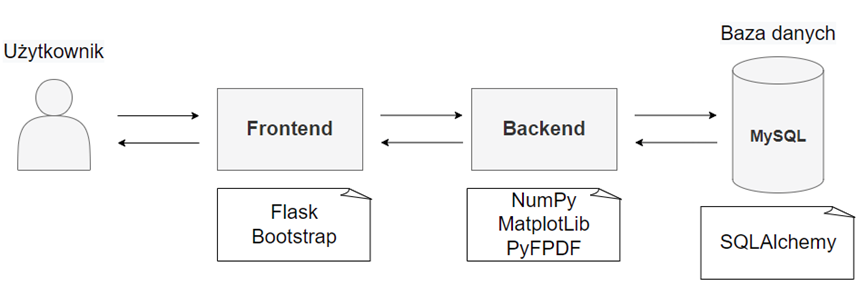
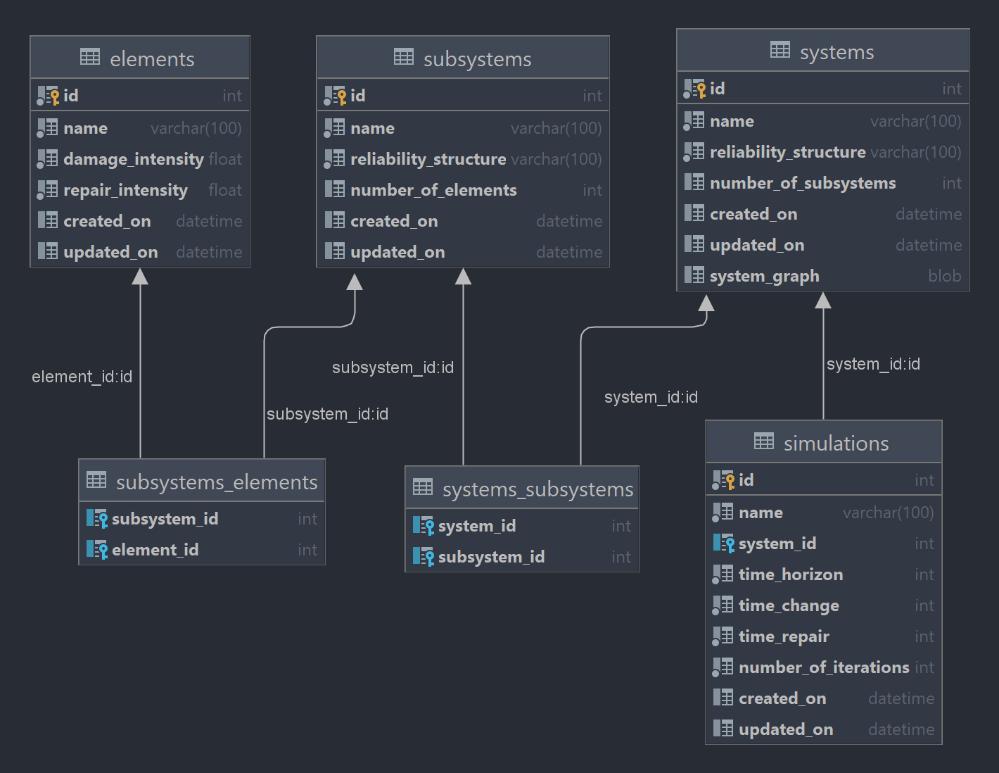
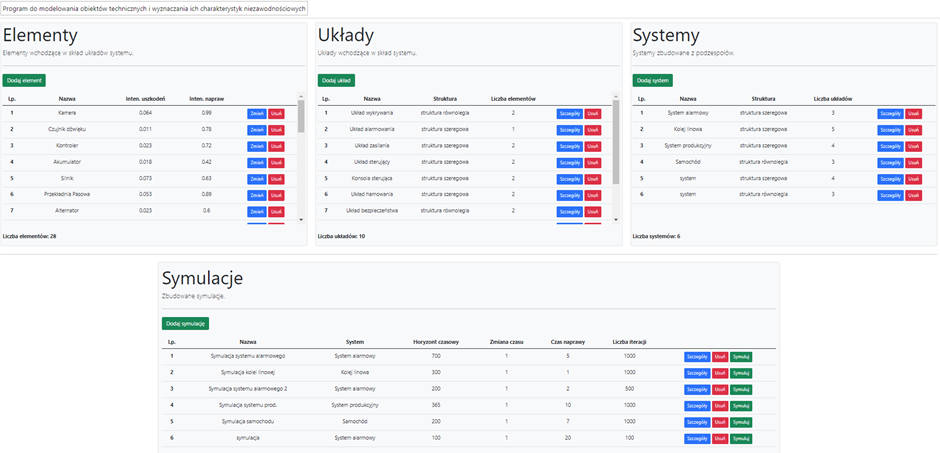
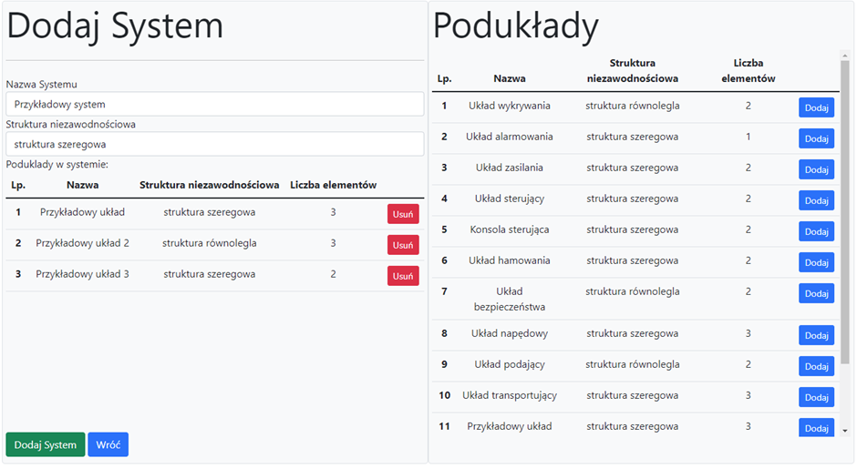
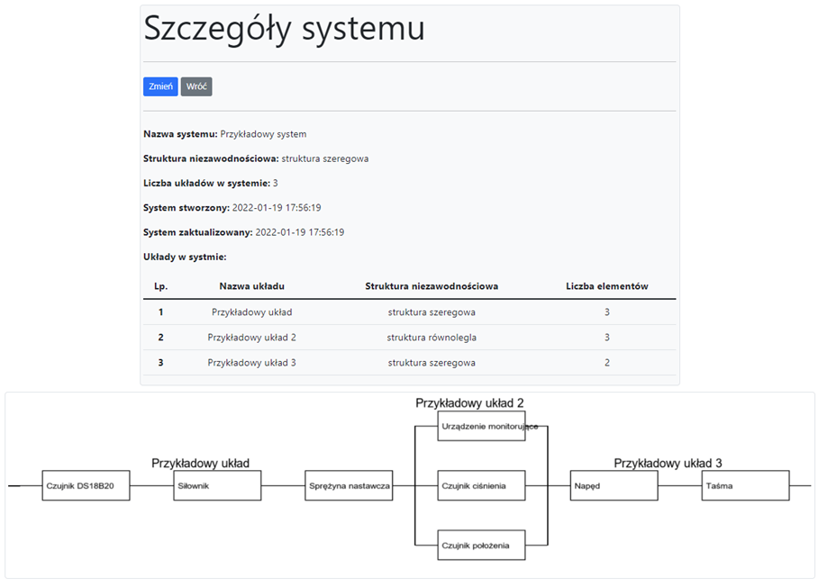
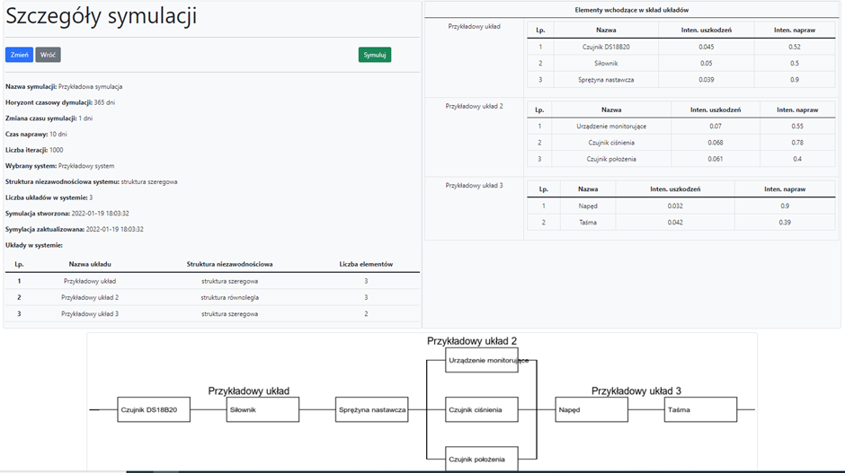
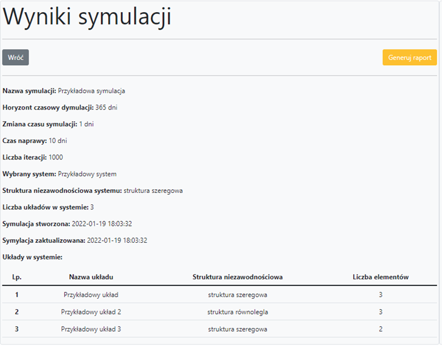
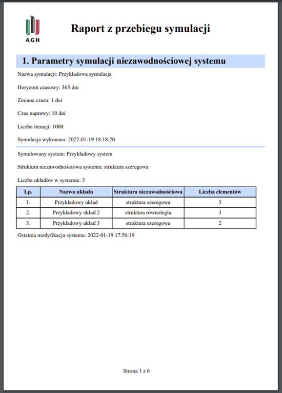
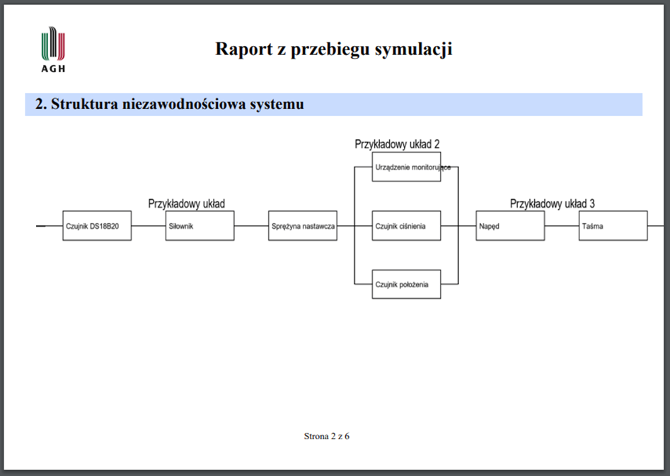

# MODELING RELIABILITY SYSTEMS PROJECT

--------------------------------------

## Table of Contents
* [General info](#general-info)
* [Technologies and Modules](#technologies-and-modules)
* [Entity Reliationship Diagram](#entity-relationship-diagram)
* [Status](#status)
* [Example Screenshots](#example-screenshots)

## General info

This project enables the tabular construction of 
reliability systems of technical objects and the 
determination of their parameters in simulations. 
Diagram of the modeled system is generated automatically.
In addition, you can generate the results of the 
simulation in pdf format.

## Technologies and Modules
* Python
* MySQL
* MySqlConnector/Python
* SQLAlchemy
* NumPy
* Matplotlib
* PIL
* PyFPDF
* FLASK
* Bootstrap

## Entity Relationship Diagram

## Status
Project is: _completed_

## Example Screenshots

